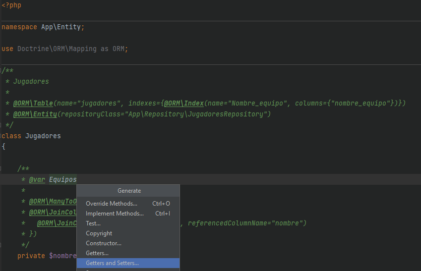
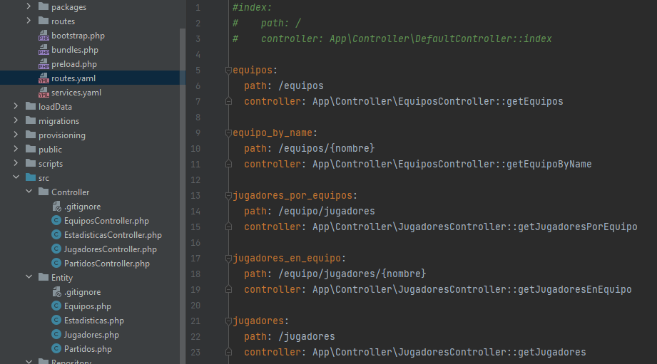
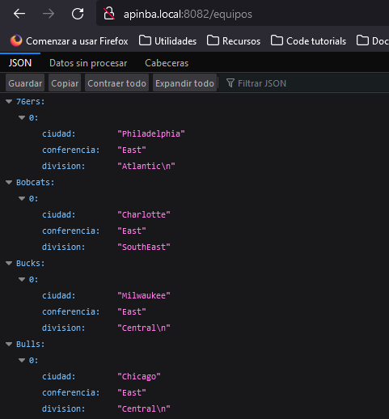
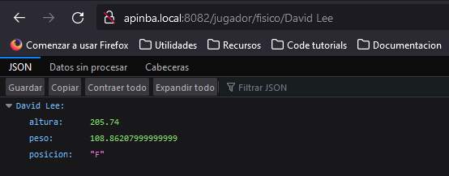
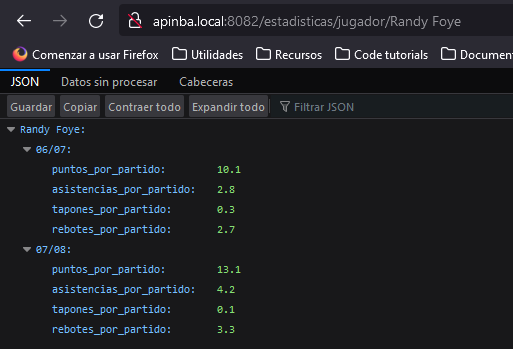
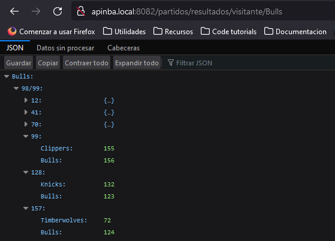
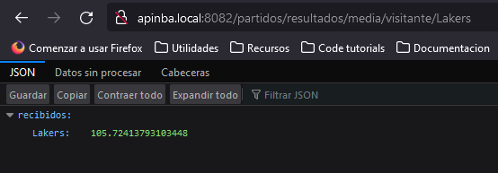

# Proyecto Symfony NBA

### Descripción 🔎️


_Proyecto de práctiCa para el desarrollo de una aplicación web con Symfony y Doctrine.  
Crea un proyecto desde cero con una base de datos de prueba de la NBA, importando un 
archivo sql a un servidor de base de datos y cargando la información a sus tablas con 
scripts de python desde la consola._

### Pre-requisitos 📋


_- Disponer de un contenedor Docker con MySQL accesible o un servidor de base de datos._ <br/>

_Crear una copia de la carpeta **sf-app-provisioning** de nuestro proyecto **Symfony** anterior y 
renombrarla a **apinba**. Podemos mover la carpeta a otro directorio para trabajar más cómodamente._

```
// Por consola
cp -R sf-app-provisioning apinba
mv apinba ../apinba
cd ../apinba
```
<br/>


_- Relizar las siguientes modificaciones en los archivos a continuación:_

* _**.env.webapp**:_
```
APACHE_SERVER_NAME=apinba.local
APACHE_SERVER_ALIAS=apinba.local
APACHE_DOCUMENT_ROOT=/code/public
```
<br/>


* _**docker-compose.yml**:_
```
container_name: apinba
```
<br/>


_Podemos incluir un dominio personalizado en nuestro archivo **hosts** para acceder a la aplicación de **Symfony**
de manera más intuitiva._


* _**etc/hosts (Linux)**_ o _**C:\Windows\System32\drivers\etc\hosts (Windows)**._
```
127.0.0.1	apinba.local
```


## Instalación 🚀

_Una vez realizados los pre-requisitos, construimos el contenedor y 
accedemos a él para crear nuestro proyecto._

```
docker-compose up --build
docker exec -it apinba bash
```
<br/>

_A continuación creamos el proyecto Symfony indicando la versión y evitando la
inicialización de un repositorio git._ 
_Esto creará un nuevo directorio con el mismo nombre **apinba**. Movemos el contenido de este
 a nuestro directorio de trabajo._

```
symfony new apinba --version=4.4 --full --no-git
mv apinba/* .
mv apinba/.env .
```
<br/>

_Abrimos el navegador y accedemos a la url de nuestro proyecto. Si no es accesible debemos cambiar los 
permisos del directorio **var/log** de nuestro proyecto._

```
chmod 777 -R var/log
```
<br/>


### Conexión e importación de base de datos 🔗


_Al construir el contenedor de Docker se ha instalado el **cliente de mysql**, con el cual vamos a conectarnos a
nuestro **contenedor** o **servidor de base** de datos para importar el archivo **.sql** (en caso de tener uno)_
```
mysql -u root -pdbrootpass -h mysql-container < loadData/nba_2022-02-02.sql
```
<br/>


### Insertar datos en las tablas 💾


_Al igual que mysql-client, **python** viene instalado por defecto al levantar el contenedor. Ejecutamos los **scripts** de python para insertar datos en el siguiente orden:_
```
python3 scripts/equipos.py  
python3 scripts/jugadores.py  
python3 scripts/partidos.py  
python3 scripts/estadisticas.py
```
<br/>


### Doctrine. Entities y repositorios 🗃️


_El siguiente comando permite incluir el bundle **beberlei**, que añade unas dependencias extra en el proyecto para 
facilitar el uso de las bases de datos con doctrine.
Un ejemplo incluyendo **GroupConcat** y **DateFormat**:_ 
```
composer require beberlei/doctrineextensions  

// Incluir en el archivo doctrine.yaml (bajo 'auto-mapping', a la misma altura)
dql:
    string_functions:
        group_concat: DoctrineExtensions\Query\Mysql\GroupConcat
        date_format: DoctrineExtensions\Query\Mysql\DateFormat
```
<br/>


Añadimos las siguientes variables de entorno al archivo _**.env**:_
```
DB_HOST=mysql-container
DB_PASSWORD=dbrootpass
DB_USER=root
DB_NAME=nba
DB_DATABASE_URL="mysql://${DB_USER}:${DB_PASSWORD}@${DB_HOST}:3306/${DB_NAME}?serverVersion=5.7"
```
<br/>


_Creamos las distintas entities desde la base de datos:_
```
php bin/console doctrine:mapping:convert annotation src/Entity/ --from-database
```
<br/>


_Este comando creará una entity por tabla existente en la base de datos. El siguiente paso es agregarle
a cada una el **namespace** ( App\Entity ), los **getters** y los **setters** (eliminando la barra que se 
incluye junto al tipado cuando hace referencia a otros objetos)._
<p align="center">
 <kbd>  </kbd>
</p>
<br/>

_El siguiente paso es crear, en sus respectivas carpetas, las clases php que servirán de **repositorios** y **controladores** de cada entidad,
desde los cuales operaremos con la base de datos. Los controladores serán referenciados en las distintas rutas de nuestra api en el 
archivo **routes.yaml**:_
<p align="center">
<kbd>  </kbd>
</p>
<br/>

## Ejecutando las consultas ⚙️

_Con las **Entidades** y **Controladores** definidos y asociados a las distintas rutas en el archivo **routes.yaml**
ya se pueden consultar los datos desde nuestra aplicación Symfony_

* [apinba.local:8082/equipos](apinba.local:8082/equipos)
<p align="center">
 <kbd>  </kbd>
</p>
<br/>

* [apinba.local:8082/jugador/fisico/{nombre}](apinba.local:8082/jugador/fisico/{nombre})
<p align="center">
 <kbd>  </kbd>
</p>
<br/>

* [apinba.local:8082/estadisticas/jugador/{nombre}](apinba.local:8082/estadisticas/jugador/{nombre})
<p align="center">
 <kbd>  </kbd>
</p>
<br/>

* [apinba.local:8082/partidos/resultados/visitante/{nombre}](apinba.local:8082/partidos/resultados/visitante/{nombre})
<p align="center">
 <kbd>  </kbd>
</p>
<br/>

* [apinba.local:8082/partidos/resultados/media/visitante/{nombre}](apinba.local:8082/partidos/resultados/media/visitante/{nombre})
<p align="center">
 <kbd>  </kbd>
</p>
<br/>

<br/>

## Construido con 🛠️

_Menciona las herramientas que utilizaste para crear tu proyecto_

* [Docker](https://docs.docker.com/) - Plataforma de desarrollo
* [Symfony](https://symfony.com/) - Framework PHP
* [Doctrine](https://www.doctrine-project.org/) - ORM

## Autores ✒️

* **Antonio Calabuig** - *Trabajo Inicial* - [buig](https://github.com/buig)
* **Juan Carlos Aguirre** - *Documentación* - [jcarlosaguirre](https://github.com/jcarlosaguirre)


## Licencia 📄

Este proyecto está bajo la Licencia (Tu Licencia) - mira el archivo [LICENSE.md](LICENSE.md) para detalles


